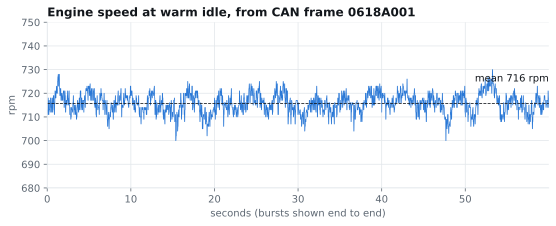
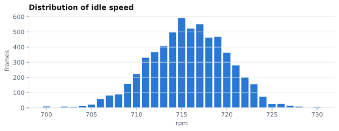
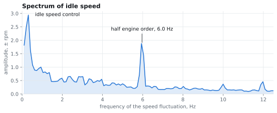

# Example results

Everything below was read from the car described in [protocol.md](protocol.md) in one
session. The VIN and serial numbers are removed. Raw logs are in
[examples/logs](../examples/logs).

## Identification

```
$ python -m carwhisperer ident
  F187 spare part number            51926690
  F192 supplier hardware number     IAW5SFHW405
  F194 supplier software number     881AW23E
  F196 ECU name                     5SF9AG
  F181 application software id      01 01 "881A"
  F182 application data id          01 01 "W23E"
  F186 active session               01
```

The body computer at address `40` returned the car's VIN, and the engine ECU's own VIN field
was blank. The VIN prefix `ZFA199` identifies a Fiat type 199, the Grande Punto.

## Fault codes

```
confirmed: 1
  P0135-14  status 08  confirmedDTC
pending: 0
failing now: 0
```

The code is in the three-byte UDS form: `P0135` plus failure type `14` (circuit short to
ground or open). The status byte carries more than a generic scanner shows. Read once with the
engine off, the status was `48`: confirmed, and not yet tested in this operating cycle. Read
again with the engine running it was `08`: confirmed, tested, and not failing. So the status
byte separates a stored code from a fault that is present now.

Asking with mask `FF` returned 27 records, all with status `40`. Those are monitors the ECU
supports, not faults. The confirmed code was missing from that reply, so the list appears to be
cut short. Use the specific masks instead.

## Live values

Read with `22 xxxx` from the engine ECU.

| Identifier | Ignition on, engine off | Running, warming up | Running, warm |
|---|---|---|---|
| `1000` engine speed | 0 rpm | 795 to 806 rpm | 707 to 727 rpm |
| `1003` coolant temperature | 62 °C | 62 to 66 °C | 93 to 95 °C |
| `1004` battery voltage | 12.3 V | 14.2 to 14.3 V | 14.2 to 14.3 V |
| `1009` unidentified | 77 raw | 98 to 102 raw | 161 to 163 raw |

Polling four identifiers over BLE gives about one complete set every two seconds.

## Idle-speed capture

Frame `0618A001` carries engine speed and is broadcast every 10 ms. It was recorded passively,
with the adapter in silent mode, in six bursts of 10 seconds. The engine was warm and idling
in neutral with no electrical loads. The raw data is in
[examples/idle_rpm_frames.json](../examples/idle_rpm_frames.json).

```
$ python -m carwhisperer analyze examples/idle_rpm_frames.json
frames 5995, mean 715.7 rpm, stdev 4.3, range 700-730
value changes per second 21.0, largest drop between frames 11 rpm
crank rotation 11.93 Hz
  below 2 Hz        ±5.42 rpm
  half order        ±2.55 rpm (peak bin 1.88, background 0.27)
  first order       ±0.66 rpm
```

| Burst | Frames | Min | Max | Mean | Std dev |
|---|---|---|---|---|---|
| 1 | 998 | 705 | 728 | 716 | 3.9 |
| 2 | 999 | 700 | 725 | 714 | 4.5 |
| 3 | 998 | 706 | 725 | 716 | 3.9 |
| 4 | 999 | 704 | 724 | 715 | 4.0 |
| 5 | 1001 | 700 | 726 | 716 | 4.0 |
| 6 | 1000 | 705 | 730 | 716 | 4.8 |





### Frequency content



The spectrum is the average of the six bursts, each 960 samples with a Hann window, which
gives a resolution of about 0.1 Hz.

- **Below 1 Hz.** The largest component, about ±3 rpm with a period of three to five seconds.
  This is the idle speed controller making corrections.
- **Half engine order, 6.0 Hz.** A narrow peak of about ±1.9 rpm, seven times the surrounding
  level, present in all six bursts. Half order means once per complete four-stroke cycle,
  which is two crankshaft turns. A component at that frequency arises when the cylinders do
  not contribute equally.
- **First order, 11.9 Hz.** Small, about ±0.7 rpm.
- **Above 12 Hz.** Not resolvable. The frame arrives 100 times per second, but its value
  changes only about 21 times per second. The ECU appears to compute engine speed once per
  firing segment, which is 23.9 times per second at this speed. So the firing frequency itself
  cannot be seen in this signal, and the reported speed is already smoothed.

Other fields in the same capture: the accelerator pedal byte stayed at zero, and the throttle
plate position in frame `0628A001` moved between 4 and 7 counts, mostly 6.

## How long things take

| Step | Time |
|---|---|
| Module address sweep, 256 addresses | 54 s |
| Sweep of one 256-identifier block | 51 s |
| Sweep of the whole 16-bit identifier space, at that rate | about 3.6 hours |
